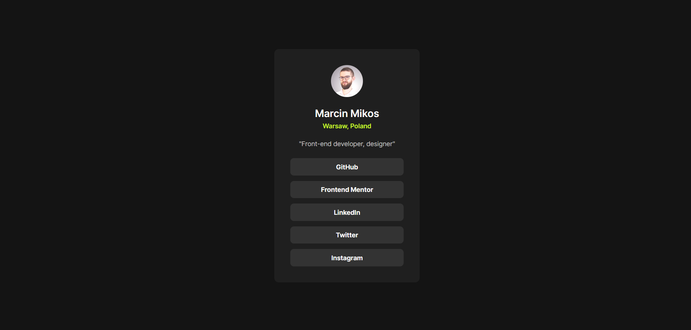

# Frontend Mentor - Blog preview card solution

This is a solution to the [Social links profile challenge on Frontend Mentor](https://www.frontendmentor.io/challenges/social-links-profile-UG32l9m6dQ).

## Table of contents

- [Frontend Mentor - Blog preview card solution](#frontend-mentor---blog-preview-card-solution)
  - [Table of contents](#table-of-contents)
  - [Overview](#overview)
    - [Screenshot](#screenshot)
    - [The challenge](#the-challenge)
  - [Links](#links)
  - [What have I learned](#what-have-i-learned)
  - [Built with](#built-with)
  - [Acknowledgements](#acknowledgements)
  - [Contact](#contact)

## Overview

### Screenshot



### The challenge

The challenge was to recreate the application based on a static graphic design in jpg format.

Users should be able to:

- See hover and focus states for all interactive elements on the page

## Links

- [Solution]()
- [Live Site](https://marcin-m-frontend-mentor-social-link-profile.vercel.app/)

## What have I learned

I used Node.js script to populate button list from the template. `populate-socials.js` script gets data from `social-profiles.json`, and converts it to buttons list with help of HTML templates. Thanks to that, all you need to do is add new buttons data to `social-profiles.json` file and run this script to build new index.html file:

```
npm run build:html
```

This solution helps do avoid adding repetitive social button code, and stick to the DRY programming principle.

## Built with

- Semantic HTML5 markup
- CSS Reset boilerplate code
- CSS Normalise boilerplate code
- [SASS preprocessor](https://sass-lang.com/)
- [Node.js](https://nodejs.org/en) for buttons templating (SSG) with help of server-side script
- JSON for data storage
- BEM architecture
- Elements of 7-1 SASS architecture

## Acknowledgements

- Normalize.css based on [repository by Nicolas Gallagher and Jonathan Neal](https://github.com/necolas/normalize.css/)
- Reset.css based on ["A Modern CSS Reset" by Josh Comeau](https://www.joshwcomeau.com/css/custom-css-reset/)

## Contact

Coded by [Marcin Mikos](mailto:mikos.marcin.m@gmail.com) - feel free to cotnact me!
